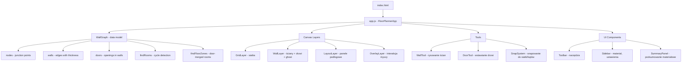
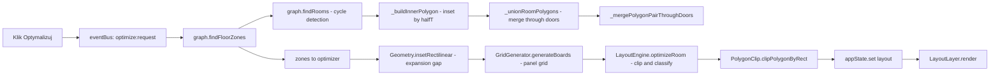

# FloorPlanner — Dokumentacja Projektu

## Co to jest

FloorPlanner to aplikacja webowa do **planowania układania podłóg** (paneli podłogowych). Użytkownik rysuje ściany, tworząc pokoje, wstawia drzwi, a system **optymalizuje układ paneli** z uwzględnieniem dylatacji, docinków i ciągłości wzoru przez otwory drzwiowe.

## Środowisko

- **Brak serwera** — aplikacja uruchamiana bezpośrednio z pliku: `file:///C:/Projekty/moje/floorPlanner/index.html`
- **Vanilla JS** — bez frameworków, bez bundlera
- **Canvas 2D** — renderowanie wielowarstwowe na 4 canvas'ach

---

## Architektura



### Wzorzec komunikacji

```
EventBus (pub/sub) ← centralny bus zdarzeń
AppState (reactive) ← stan aplikacji z observerami
CommandManager (undo/redo) ← Ctrl+Z / Ctrl+Y
```

---

## Struktura plików

### Główne

| Plik | Opis |
|---|---|
| `index.html` | Strona HTML, CSS, script tags |
| `js/app.js` | `FloorPlannerApp` (facade) + `WallOverlayLayer` (interakcja) |
| `js/event-bus.js` | EventBus — pub/sub |
| `js/state.js` | AppState — reaktywny stan z observerami |
| `js/command-manager.js` | Undo/Redo stack |

### Data Model (`js/data/`)

| Plik | Opis |
|---|---|
| `js/data/wall-graph.js` | **Główny model danych** — planarny graf ścian. Nodes, Walls, Doors. Wykrywanie pokojów (minimal cycles), łączenie pokojów przez drzwi (floor zones), budowanie inner polygonów |
| `js/data/presets.js` | Presety materiałów (panele, deski) |

### Canvas Layers (`js/canvas/`)

| Plik | Opis |
|---|---|
| `js/canvas/viewport.js` | Zoom, pan, world↔screen konwersje |
| `js/canvas/grid-layer.js` | Siatka milimetrowa/centymetrowa |
| `js/canvas/wall-layer.js` | **Renderowanie ścian, drzwi, ghost preview** — `_drawWalls`, `_drawDoors` (z `destination-out` compositing), `_drawGhostDoor`, wymiary od narożników |
| `js/canvas/room-layer.js` | Wypełnianie wykrytych pokojów kolorem |
| `js/canvas/layout-layer.js` | Renderowanie paneli podłogowych po optymalizacji |
| `js/canvas/overlay-layer.js` | Warstwa interakcji — mouse events, drag, select |

### Engine (`js/engine/`)

| Plik | Opis |
|---|---|
| `js/engine/optimizer.js` | `layoutOptimizer.optimizeAll()` — koordynuje optymalizację |
| `js/engine/grid-generator.js` | Generuje siatkę paneli (stagger, kierunek) |
| `js/engine/herringbone-generator.js` | Generuje siatkę jodełki 45° — konstrukcja schodkowa w przestrzeni (u,v), wektory kraty s=(W,W), t=(L,−L); okresy w świecie: (W√2, 0) i (0, L√2) |
| `js/engine/layout-engine.js` | Klipuje panele do polygonu pokoju, klasyfikuje docinki |
| `js/engine/polygon-clip.js` | Sutherland-Hodgman clipping + `_splitCollinearOpposite` (dumbbell split) |
| `js/engine/geometry.js` | `Geometry.insetRectilinear` — dylatacja polygonów, operacje geometryczne |
| `js/engine/room-decomposer.js` | Dekompozycja nie-prostokątnych pokojów na prostokąty |
| `js/engine/layout-scorer.js` | Scoring layoutu (minimalizacja odpadów) |

### Tools (`js/tools/`)

| Plik | Opis |
|---|---|
| `js/tools/wall-tool.js` | Narzędzie rysowania ścian — click-click (nie drag) |
| `js/tools/door-tool.js` | Narzędzie wstawiania drzwi — ghost preview, snap do środka/siatki, wymiary od narożników |
| `js/tools/snap-system.js` | Snapowanie do siatki, kątów 45°/90° |
| `js/tools/dimension-input.js` | Input wymiarów (wpisywanie mm po narysowaniu ściany) |

### UI (`js/ui/`)

| Plik | Opis |
|---|---|
| `js/ui/toolbar.js` | Pasek narzędzi — Ściana, Prostokąt, Drzwi, Zaznacz, Usuń |
| `js/ui/sidebar.js` | Panel boczny — pokoje, ściany, materiał, ustawienia |
| `js/ui/summary-panel.js` | Podsumowanie materiałowe — powierzchnia, panele, odpady |

### Commands (`js/commands/`)

| Plik | Opis |
|---|---|
| `js/commands/wall-commands.js` | `AddWallCommand`, `RemoveWallCommand`, `MoveNodeCommand`, `AddDoorCommand` |

---

## Przepływ danych — Optymalizacja



### Kluczowe algorytmy

#### 1. Wykrywanie pokojów (`findRooms`)
- Buduje listę sąsiedztwa z directed edges
- Dla każdej krawędzi: obraca najdalej w lewo (angle-based face traversal)
- Minimalny cykl = pokój (z filtrem winding + area)

#### 2. Inner polygon (`_buildInnerPolygon`)
- Offsetuje krawędzie pokoju o `wall.thickness / 2` do wewnątrz
- Oblicza przecięcia sąsiednich krawędzi → wierzchołki inner polygon
- Generuje `wallIds[]` mapujący krawędzie na ściany

#### 3. Floor Zones (łączenie pokojów przez drzwi)
- **Union-Find** do grupowania pokojów połączonych przez ściany z drzwiami
- **_mergePolygonPairThroughDoors** — merging dwóch polygonów:
  - Wchodzi do B przez **pierwszy drzwi** (bridge, `wallId=null`)
  - Obchodzi **cały obwód B** (outer perimeter)
  - Wraca **segmentowaną shared edge B** (drzwi=`null`, ściana=`sharedWallId`)
  - Powraca do A przez **pierwsze drzwi EXIT**
  - Idzie **shared edge A** z segmentami drzwi/ściana

#### 4. Polygon clipping (`clipPolygonByRect`)
- Sutherland-Hodgman clip (4 half-planes)
- **`_splitCollinearOpposite`** — dzieli "dumbbell" polygony (panel krzyżujący 2 otwory z murem między nimi)

---

## Stan aktualny (29.06.2026)

### Co działa

| Feature | Status |
|---|---|
| Rysowanie ścian (click-click + prostokąt) | OK |
| Snapowanie do siatki i kątów | OK |
| Wykrywanie pokojów z named rooms | OK |
| Ściana dzieląca pokój → 2 pokoje | OK |
| Wstawianie drzwi z ghost preview | OK |
| Snap drzwi do środka ściany | OK |
| Wymiary od narożników przy ghost | OK |
| Rendering otworu drzwiowego (destination-out) | OK |
| Optymalizacja paneli — 1 pokój | OK |
| Optymalizacja — 2 pokoje, 1 drzwi | OK |
| Optymalizacja — 3 pokoje, 2 ściany, po 1 drzwiach | OK |
| Optymalizacja — 2 pokoje, 2+ drzwi na 1 ścianie | OK |
| Dylatacja przy ścianach | OK |
| Brak dylatacji przy otworach drzwiowych | OK |
| Ściana między drzwiami → dylatacja | OK |
| Jodełka klasyczna 45° (generator + presety) | OK |
| Jodełka — orientacja rzędów (poziomo/pionowo) | OK |
| Rysowanie ścian od krawędzi podłogi (reference: inner) | OK |
| Undo/Redo | OK |
| Zoom/Pan | OK |
| Podsumowanie materiałowe | OK |

### Co zostało do zrobienia

| Feature | Priorytet | Opis |
|---|---|---|
| Wybór szerokości otworu drzwiowego | Wysoki | Użytkownik zasugerował "Później dodamy możliwość wyboru otworu" — UI do zmiany `door.width` |
| Usuwanie drzwi | Wysoki | Brak narzędzia do usuwania wstawionych drzwi |
| Edycja drzwi (drag) | Średni | Przesuwanie drzwi po ścianie |
| Eksport/Import planu | Średni | Zapis/wczytanie projektu (JSON) |
| Lepsze wymiarowanie ścian | Średni | Stałe wymiary na ścianach (nie tylko ghost) |
| Tryb "Zaznacz" dla drzwi | Niski | Selekcja i edycja drzwi w trybie zaznaczania |
| Okna | Niski | Dodanie okien (nie wpływają na podłogę, ale na plan) |

---

## Naprawione bugi (sesja 29.06)

### 1. Wykrywanie pokojów — ściana dzieląca nie tworzyła 2 pokojów
- **Plik:** `js/data/wall-graph.js`
- **Fix:** Poprawiono filtr winding i normala w `_buildInnerPolygon`

### 2. Rendering otworu drzwiowego — `t1`/`t2` parenthesis bug
- **Plik:** `js/canvas/wall-layer.js` → `_drawDoors`
- **Było:** `Math.max(0, (door.position - door.width / 2)) / wallLen` — dzieliło `Math.max` result/wallLen
- **Fix:** `Math.max(0, (door.position - door.width / 2) / wallLen)` — dzieli wewnątrz `Math.max`
- **Plus:** Zamiana `fillStyle='rgba(12,14,18,0.8)'` na `destination-out` compositing

### 3. Multi-door merge — wallIds misalignment
- **Plik:** `js/data/wall-graph.js` → `_mergePolygonPairThroughDoors`
- **Problem:** Conditional push rozjechał wallIds z vertices
- **Fix:** Nowy `push(pt, wallId)` helper z deduplication

### 4. Multi-door na jednej ścianie — brak dylatacji między drzwiami
- **Plik:** `js/data/wall-graph.js` → `_mergePolygonPairThroughDoors`
- **Problem:** `enterDist`/`exitDist` z extreme doors → cała przestrzeń traktowana jako 1 otwór
- **Fix:** Per-door `doorSegs[]`, B shared edge segmentacja, A shared edge z wall/door markers

### 5. Sutherland-Hodgman "dumbbell" polygon
- **Plik:** `js/engine/polygon-clip.js`
- **Problem:** Panel krzyżujący 2 otwory tworzył polygon z zero-width neck
- **Fix:** Nowa metoda `_splitCollinearOpposite()` — detektuje pary krawędzi A→B / B→A i dzieli

---

## Naprawione bugi (sesja 02.07.2026)

### 6. Jodełka — generator nie tworzył wzoru jodełki
- **Pliki:** `js/engine/herringbone-generator.js`, `js/engine/optimizer.js`
- **Problem:** Algorytm pasmowy segregował orientacje: pojedyncza ukośna "nitka" paneli +45° (koniec-do-końca) + szerokie pole równoległych paneli −45°. Stosunek paneli +45:−45 wynosił ~W:L (≈1:5) zamiast 1:1.
- **Fix:** Konstrukcja schodkowa w (u,v): H(i,k) w narożniku `(kW+iL, kW−iL)` [L×W], V(i,k) w `(kW+iL+L, kW−iL+W−L)` [W×L]. Krótki koniec każdego panelu opiera się o długi bok panelu przeciwnej orientacji (połączenie V). Szczelne kafelkowanie dla dowolnych L, W. W optimizerze okresy przeszukiwania offsetu: `W√2` (x), `L√2` (y).
- **Testy:** `tests/engine/herringbone.test.js` — stosunek 1:1, test połączenia V (punkt za końcem panelu leży w panelu przeciwnego kąta), brak nakładek, szczelność pokrycia. Deska testowa 625×125.

### 6b. Jodełka — orientacja układania (direction)
- **Pliki:** `js/engine/herringbone-generator.js`, `js/engine/layout-engine.js`, `js/engine/optimizer.js`, `js/ui/sidebar.js`, `index.html`
- `config.direction` (stopnie): 0 = rzędy jodełki wzdłuż osi X, 90 = wzdłuż osi Y. Implementacja: generacja w ramce obróconej o −90° wokół środka bboxa + obrót paneli z powrotem (+45° ↔ −45°).
- **Ważne:** jodełka jest niezmiennicza na obrót o 180° (obrót wokół środka dowolnej deski mapuje wzór na siebie — grupa tapetowa pgg), więc generator normalizuje kierunek modulo 180 (180≡0, 270≡90). Test kontraktowy w `herringbone.test.js` to dokumentuje.
- UI: toggle kierunku (`#direction-toggle`, `laying.direction`) wyciągnięty z `#straight-only-settings` — działa dla obu wzorów; przy jodełce etykieta zmienia się na „Kierunek rzędów jodełki". W `#straight-only-settings` został tylko stagger.
- Optimizer: okresy przeszukiwania offsetu dla jodełki zależne od kierunku — dir 0: `(W√2, L√2)`, dir 90: `(L√2, W√2)`.

### 6c. Rysowanie ścian od krawędzi podłogi (wymiary w świetle)
- **Pliki:** `js/tools/wall-tool.js`, `js/tools/snap-system.js`, `js/state.js`, `js/ui/sidebar.js`, `index.html`
- **Problem:** rysowanie i wpisywane długości szły po osi ściany, więc pokój „4000×3000" ze ścianami 150 dawał podłogę 3850×2850.
- **Rozwiązanie:** `wallDefaults.reference: 'axis' | 'inner'` (select „Rysowanie od" w sekcji Ściany). W trybie `inner`:
  - klikane punkty i wpisywane długości = narożniki/wymiary PODŁOGI,
  - oś ściany = linia odsunięta o T/2 na `side` (klawisz **F** przełącza stronę, domyślnie na lewo od kierunku rysowania),
  - węzły w narożnikach = przecięcie odsuniętych osi (`Geometry._lineIntersection`) — miter leży na obu osiach, więc przesunięcie węzła tylko wydłuża/skraca już postawione ściany,
  - domykanie pętli po punkcie wewnętrznym łańcucha (`_innerChain.startPt`),
  - snap do węzłów/krawędzi wyłączony (`nodeSnap:false, edgeSnap:false` w SnapSystem) — punkty wewnętrzne i osiowe to różne układy odniesienia,
  - ghost pokazuje pas ściany w pełnej grubości na zewnątrz rysowanej linii.
- Inner polygon (inset T/2) odtwarza dokładnie klikany obrys → podłoga = zadane wymiary. Testy: `tests/tools/wall-tool-inner.test.js`.
- **Ograniczenie V1:** w trybie `inner` nie można dołączać do istniejących ścian (T-junction) — do dorysowania działówek służy tryb `axis`.

### 6d. Undo dodania ściany było no-opem
- **Pliki:** `js/commands/wall-commands.js`, `js/tools/wall-tool.js`
- **Problem:** `AddWallCommand.execute()` robił snapshot grafu — ale WallTool dodawał ścianę PRZED wykonaniem komendy, więc snapshot zawierał już ścianę i `undo()` przywracał stan ze ścianą (nic nie cofał).
- **Fix:** WallTool przechwytuje `graph.serialize()` przed mutacjami (dla pierwszej ściany łańcucha — w `_startDrawing`, przed utworzeniem węzła startowego; potem `_pendingBefore`) i przekazuje jako `beforeSnapshot` do `AddWallCommand`. `undo()` przywraca stan sprzed (usuwa też osierocone węzły i cofa miter w trybie inner), `execute()` przy pierwszym uruchomieniu zapisuje stan „po" dla redo.
- **Testy:** `tests/commands/add-wall-undo.test.js` — undo/redo pojedynczej ściany, łańcucha i miterowania inner.

### 7. Presety dla jodełki + dynamiczny dropdown
- **Pliki:** `js/data/presets.js`, `js/ui/sidebar.js`, `index.html`
- Nowa lista `HERRINGBONE_PRESETS` (kategoria „Jodełka": 625×125, 720×120, 600×150, 490×70) + `getPresetsForPattern(pattern)`.
- Dropdown presetów budowany dynamicznie z presets.js (`Sidebar._rebuildPresetDropdown`) — usunięto hardcode z index.html (był już rozjechany z JS). Zmiana wzoru na jodełkę filtruje listę i auto-wybiera pierwszy pasujący preset, jeśli aktywny nie nadaje się do jodełki.

---

## Konwencje

### Współrzędne
- Wszystkie w **milimetrach (mm)**
- Y-down (screen coords)
- `Viewport.worldToScreen` / `screenToWorld` do konwersji

### WallGraph konwencje
- `wallIds[k]` = wall ID krawędzi kończącej się na `polygon[k]` (incoming edge)
- `wallId = null` → brak ściany (otwór drzwiowy / bridge)
- `wallId = sharedWallId` → ściana (potrzebna dylatacja)

### Globalne zmienne (debug)
- `window._wallGraph` — graf ścian
- `window._viewport` — viewport
- `eventBus` — event bus
- `appState` — stan aplikacji

### Komendy debug
```javascript
// Dodaj drzwi programistycznie
_wallGraph.addDoor(wallId, position, width)
_wallGraph._invalidateCache()
eventBus.emit('graph:change')

// Uruchom optymalizację
eventBus.emit('optimize:request')

// Sprawdź pokoje i strefy
_wallGraph.findRooms()
_wallGraph.findFloorZones()
```

### Domyślne wartości
- Grubość ściany: **150mm** (cegła)
- Szerokość drzwi: **800mm**
- Panel: **1380 x 193 mm**
- Dylatacja: **10mm**
- Min. docinki: **50mm** szer, **300mm** dł

---

## Dev Server & Testy

### Dev Server
```bash
npm run dev    # live-server na http://localhost:3000 z auto-reload
```
Alternatywnie: `file:///C:/Projekty/moje/floorPlanner/index.html` (bez serwera).

### Testy jednostkowe
```bash
npm test             # jednorazowe uruchomienie (80 testów)
npm run test:watch   # watch mode — re-run po zmianach w js/ i tests/
```

Własny mini-runner (`tests/run.js`) z `vm.Script` sandbox — ładuje globalne obiekty JS bez potrzeby ES modules. Pliki testowe: `tests/**/*.test.js`.

API: `describe()`, `it()`, `beforeEach()`, `assert.equal/closeTo/deepEqual/ok/notOk/throws/greaterThan/lessThan/arrayLength`.

Pokrycie: Geometry, PolygonClip, WallGraph (CRUD + findRooms + findFloorZones + serialize).

### Workflow TDD (Test-Driven Development)

Przy implementacji nowych feature'ów i bugfixów **obowiązuje TDD**:

1. **RED** — Napisz test(y) opisujące oczekiwane zachowanie. Uruchom `npm test` — testy muszą FAILOWAĆ.
2. **GREEN** — Napisz minimalny kod, który sprawia, że testy przechodzą.
3. **REFACTOR** — Uporządkuj kod, upewnij się, że testy nadal przechodzą.

Zasady:
- **Nie pisz kodu produkcyjnego bez odpowiedniego testu.** Każda nowa funkcja/metoda w `js/engine/` lub `js/data/` powinna mieć odpowiedni plik `.test.js`.
- **Bugfix = najpierw test reprodukujący buga**, potem fix.
- **Testy regresyjne**: Po naprawie buga zostaw test, żeby nie wrócił.
- Wyjątek: kod UI/DOM (canvas layers, toolbar, sidebar) — testowany manualnie w przeglądarce.

---

## Wskazówki dla przyszłych sesji

1. **Dev workflow**: `npm run dev` → otwórz `http://localhost:3000`. Przeglądarka auto-reload po zmianach. Użyj `Ctrl+Shift+R` do force reload.

2. **Debugowanie**: `window._wallGraph` i `eventBus` dostępne w konsoli. Można programistycznie dodawać ściany/drzwi i triggerować optymalizację.

3. **Arch pattern**: Nowe narzędzia wzoruj na `WallTool` / `DoorTool`. Nowe komendy na `AddWallCommand` / `AddDoorCommand`.

4. **Rendering**: `WallLayer` renderuje w kolejności: grid → walls → doors (destination-out) → nodes → ghost preview → dimensions. Drzwi wycinają otwory z already-drawn walls.

5. **Polygon merge**: `_mergePolygonPairThroughDoors` jest najważniejszym i najkompleksowym algorytmem. Przy zmianach: sprawdź (a) brak duplikatów, (b) brak diagonalnych krawędzi, (c) poprawne wallIds.

6. **TDD**: Nowa logika → najpierw test w `tests/<kategoria>/<nazwa>.test.js`, potem implementacja. Bugfix → najpierw test reprodukujący, potem fix. Uruchom `npm test` przed każdym commitem.

